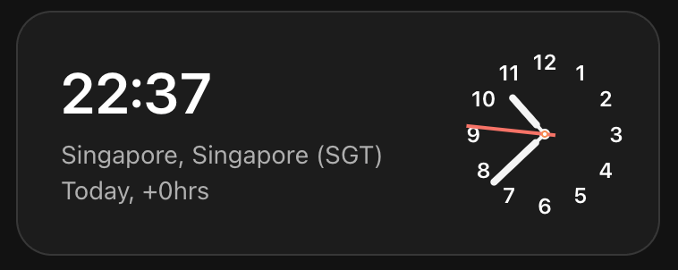
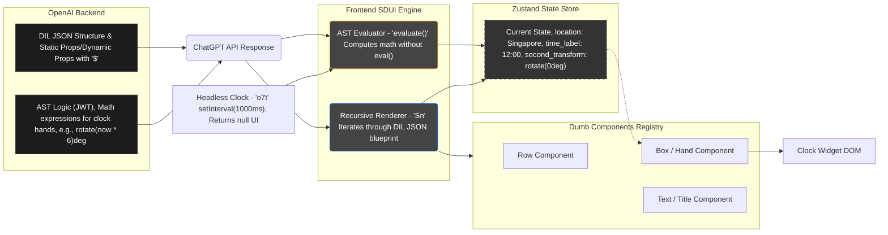

# ChatGPT Clock Widget Clone (Reverse Engineered)

This project is a technical proof-of-concept (PoC) demonstrating how ChatGPT renders dynamic widgets (e.g., the Singapore Clock) directly within the chat interface. This demo reconstructs the core architecture and UI with 1:1 accuracy, based on reverse-engineering OpenAI's actual production code.



## Setup

Run the following commands to get the demo up and running:

```bash
bun install
bun dev

# or
npm install
npm run dev

# or 
yarn install
yarn dev
```

Then open `http://localhost:5173` in your browser to see the clock widget in action.

## 🧐 What are we exploring?

The goal of this project is to understand how OpenAI solves a complex engineering problem: **How can a Large Language Model (LLM) output complex, highly interactive User Interfaces (like a real-time ticking clock) while maintaining strict security and high performance?**

Through deep analysis, we discovered that OpenAI uses a highly sophisticated **Server-Driven UI (SDUI)** architecture.


All the finding are in [debug-files](./debug-files) folder

## 🏗 System Architecture

Based on data extracted from OpenAI's API, the system operates on the following flow:

<!-- Mermaid -->


### 1. DIL (Declarative Interface Language) - The JSON Blueprint
Instead of returning raw HTML or React code, the ChatGPT backend returns a JSON file describing the UI structure using a custom DSL (Domain Specific Language). 
- **Static:** Defines the layout hierarchy (Box, Row, Col) and typography (Text, Title).
- **Dynamic:** Properties starting with a `$` (e.g., `$value`, `$style`) indicate that the value will be dynamically resolved based on the application state or logic.

### 2. Custom AST (Abstract Syntax Tree) - The Logic Brain
To make the clock hands tick without injecting malicious JavaScript (preventing XSS vulnerabilities), OpenAI sends along an AST containing mathematical operations.
- The frontend houses a custom **Evaluator** to parse this AST and calculate the rotation angles for the second and minute hands based on real-time data (`tick.now`).
- The calculated result is returned as an array of **JSON Patches** (e.g., `set("time_label", "19:05")`) to update the application state safely.

### 3. Headless Logic Components - The Stealth Engine
We discovered a special component named `RunInterval` (minified as `o7t` in production).
- This component exists in the React Tree but **returns null** (it renders absolutely nothing to the DOM).
- Its sole purpose is to run a `setInterval` loop, triggering the Evaluator every second to recalculate the time and pump the new data into the State Store.

### 4. Recursive Renderer & Component Registry - The Builder
The frontend relies on an orchestrator component (a Mapper) named `Sn`.
- `Sn` recursively traverses the JSON blueprint, matching component names (e.g., "Title", "Box") against a predefined dictionary (Registry) to render the actual React Components.
- It automatically attaches pre-hashed CSS classes (like `wkCU-`, `_7usgN`) so the UI perfectly matches the original stylesheet (`index.css`).

## 🛠 Tech Stack Used in Demo

- **React:** The core library for building the UI.
- **Zustand:** A lightweight state management library used to simulate the "Headquarters" storing the clock's data without causing unnecessary re-renders.
- **CSS Variables:** Utilizing OpenAI's original CSS variables to support Dark/Light themes seamlessly.

## 🔍 How Did We Reverse-Engineer This?

This project is the result of combining several advanced debugging techniques:
1. **Network Analysis:** Intercepting API payloads to extract the original JSON (DIL) blueprint.
2. **JWT Decoding:** Decoding tokens found in the `dil_url` to reveal the internal logic structure and `$onTickAction` commands.
3. **AST Dumping:** Writing a custom script to bypass `eval()` restrictions and dump the nested mathematical logic tree.
4. **React Fiber Tree Dumping:** Hooking into the browser's memory to extract the actual React component hierarchy currently running in production.
5. **Cross-Referencing:** Mapping minified component names (e.g., `Sfe`, `Afe`) to the final rendered HTML tags to reconstruct the Component Registry.

## 🚀 Conclusion

This architecture reveals that OpenAI has essentially built a "mini UI Operating System" inside ChatGPT. It allows them to scale to countless other widgets (stocks, weather, maps) with ultimate flexibility, without needing to update the core web application's source code for every new feature.
